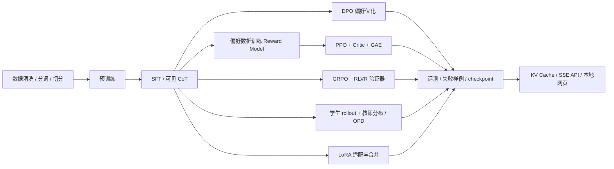

<div align="center">

# LaptopLLM-CN

### 把大模型，拆开学。

**一台电脑 · 原生 PyTorch · 中文代码教材 · 从预训练到后训练，再到本地试聊**

[](https://github.com/DaoyuanLi2816/laptop-llm-cn/actions/workflows/ci.yml)
[](pyproject.toml)
[](LICENSE)

[开始实验](#十分钟内先认识完整流程) · [中文课程](docs/course/README.md) · [技术地图](#不是名词清单每一项都有位置) · [源码对照](docs/references.md) · [验证记录](docs/validation.md)

</div>

你知道 Transformer，却还没有真正写过一套 LLM 系统？

这里不把 PPO 藏在一个 `trainer.train()` 里，也不把 MoE 当作配置文件里的缩写。
我们从一个可以读完的 decoder 开始，把 **稀疏注意力、MLA、专家路由、rollout、奖励模型、PPO/GRPO、在线蒸馏、KV Cache** 拆成能运行、能手算、能测试的模块。最后用自己的 checkpoint 打开网页聊天。

项目延续 `tiny_LLM.py` 的“代码即教材、中文讲透”风格；v0.2 从三阶段入门项目扩展为模型、后训练、系统三条学习路线。文档组织借鉴 [MiniMind](https://github.com/jingyaogong/minimind) 的低门槛实验入口，算法与系统对照公开的 DeepSeek、Qwen、verl、TRL、Megatron-LM 和 SGLang。不是它们的权重兼容实现。

熟悉原文件的读者，可以先看[从 tiny_LLM.py 到新结构的迁移地图](docs/from-tiny.md)。

> **定位要诚实。** 这是公开先进 LLM 技术的教学缩影，不是 OpenAI 内部仓库的复制品，也不保证读完即可胜任顶尖实验室的全部工作。工业系统的分布式通信、数据治理、容错、安全和性能工程会产生新的设计问题，绝不只是把参数放大。这里把这些差距也作为课程内容。

## 先看全局，再看代码



这些是**可选分支**，不是每个模型都必须依次经历的八道工序。GRPO 与 PPO 是不同优势估计路线；RLHF/RLVR 描述奖励来源；CoT 是数据与输出形式。先区分层次，才不会“技术越堆越先进”。

## 十分钟内先认识完整流程

以下是操作路径，不是所有硬件的运行时间承诺。Python 3.10+；CPU 即可，不下载模型，不使用云服务。

```bash
git clone https://github.com/DaoyuanLi2816/laptop-llm-cn.git
cd laptop-llm-cn
python -m venv .venv
```

Windows PowerShell 激活：`.\.venv\Scripts\Activate.ps1`；Linux/macOS：`source .venv/bin/activate`。

```bash
python -m pip install -e ".[dev]"
python -m pytest

# 入门：BPE → pretrain → SFT → DPO，使用仓库中文样例
laptop-llm pipeline --config configs/smoke.yaml --device cpu

# 进阶：自动生成原创算术数据，跑通全部八个阶段
python scripts/lab_smoke.py --output artifacts/my-first-lab --device cpu

# 本地网页：选择中文 smoke 权重，或换成你自己训练的权重
laptop-llm serve --checkpoint artifacts/smoke/sft/final.pt --device cpu
```

浏览器打开 **http://127.0.0.1:8000**；接口说明在 `/docs`。支持多轮历史、流式显示、温度/长度调节、清空对话、可选 API key。原始 `<think>` 文本可见，不伪装为内部思维。网页无 CDN、无前端构建和付费 API。

**smoke 模型通常只输出随机文本。** 跑通说明工程链路成立，不说明模型聪明。算术实验也是有限任务，不是通用推理基准。请先读[验证记录与负结果](docs/validation.md)，再决定是否增加训练量。

## 不是名词清单：每一项都有位置

“运行”表示有执行路径和测试；“教学”表示未实现对应生产优化；“阅读”表示尚未实现，不能当成功能宣传。

| 模块 | 本仓库实现 | 入口与边界 |
|---|---|---|
| Decoder / RoPE / RMSNorm / SwiGLU / GQA / QK Norm | 运行 | [model.py](laptop_llm/model.py)，可切换 QK Norm |
| Sparse Attention | 运行＋教学 | [sparse.py](laptop_llm/architectures/sparse.py)，真正 gather 滑窗＋sink；不是 DSA indexer 或 fused kernel |
| Hybrid Attention | 运行 | `dense_every` 混合全局层与滑窗层；cache 保留全历史 |
| MLA | 运行＋教学 | [mla.py](laptop_llm/architectures/mla.py)，latent KV cache＋权重吸收；非 DeepSeek checkpoint 布局 |
| MoE | 运行＋教学 | [moe.py](laptop_llm/architectures/moe.py)，top-k、共享专家、dropless dispatch、balance/z loss |
| Pretrain / SFT / DPO | 运行 | [engine.py](laptop_llm/engine.py)，AMP、累积、检查点、验证 |
| CoT | 运行＋教学 | 原创算术 SFT 数据的 `<think>` / `<answer>`；步骤未被验证 |
| RLHF / Reward Model | 运行＋教学 | 成对偏好训练 reward head；demo 标签为合成标签，不冒充真人反馈 |
| PPO | 运行 | 固定 old/reference、独立 critic、GAE、policy/value clipping、EOS/截断区分 |
| GRPO / RLVR | 运行 | 同题分组采样、组内标准化、规则奖励、KL、零方差组诊断 |
| On-policy Distillation | 运行 | 学生实时采样，冻结教师，回答位置 full-vocabulary reverse KL |
| LoRA | 运行 | 注入 q/v 低秩适配器、实际 SFT 更新、合并普通权重 |
| KV Cache / Serving | 运行＋教学 | GQA 与 MLA cache；串行 FastAPI、聊天 completions 与 SSE 子集 |
| DDP | 独立教学实验 | 两进程 CPU/gloo，验证梯度等于单进程全局 batch |
| DSA / FP8 / MTP / TP / PP / EP / CP / FSDP / ZeRO | 阅读 | [工业系统章节](docs/course/08-systems.md)，不宣称已集成 |
| Paged KV / continuous batching / speculative decoding / quantization | 阅读 | [服务章节](docs/course/09-serving.md)，不是高吞吐推理引擎 |

实现覆盖不是“所有顶级模型的统一标配”。例如 GQA 和 MLA 是替代设计，dense 与 MoE 各有取舍，RL 不保证胜过 SFT。

## 仓库就是课程目录

```text
laptop_llm/
  tokenizer.py          # BPE、角色模板、监督与截断边界
  data.py               # token cache、SFT、偏好对、padding
  model.py              # 可读 decoder 主干与 KV Cache
  architectures/        # sparse / MoE / MLA / LoRA 独立零件
  engine.py             # 数据驱动的 pretrain / SFT / DPO
  posttraining/
    rollout.py          # token、动作 mask、终止与旧策略概率
    rewards.py          # 规则 verifier 与 reward/value head
    objectives.py       # PPO、GAE、GRPO、KL、蒸馏的纯函数
    trainer.py          # 同步 rollout → 优化 → 指标 → checkpoint
  generation.py         # prefill、decode、采样
  server.py             # 本地网页＋HTTP/SSE
configs/                # smoke / cpu / laptop_16gb / research_moe / research_mla
scripts/                # 全流程 smoke、DDP 对照、数据导出
docs/course/            # 从 tensor 到工业系统的中文课程
tests/                  # 数值契约、训练更新、恢复、接口测试
```

建议先按[课程路线](docs/course/README.md)读，而不是从 CLI 一口气追完所有调用。

## 三档实验预算

| 档位 | 用途 | 配置/入口 |
|---|---|---|
| CPU smoke | 检查代码、学习张量与目标函数 | `smoke.yaml`、`lab_smoke.py` 的约 0.139M MoE |
| 笔记本练习 | 增加数据与步数，做控制变量实验 | `cpu.yaml`、`research_moe.yaml`、`research_mla.yaml` |
| 本机 CUDA | 较大模型实验，仍需量测峰值显存 | `laptop_16gb.yaml`；不等于所有 16GB 机器都适用 |

PPO 同时有 policy、reference、reward、critic；后训练内存预算不能直接沿用单模型推理预算。无独显先用 smoke。Apple MPS 有自动设备路径，但本次没有实机验证，不把它列为已验证平台。

### 单独运行后训练

先跑 `lab_smoke.py` 生成小数据与权重，再把路径换成自己的实验：

```bash
laptop-llm lab grpo --checkpoint artifacts/my-first-lab/sft/final.pt --data artifacts/my-first-lab/rl_train.jsonl --output artifacts/grpo-experiment --steps 20 --group-size 4
laptop-llm lab reward --checkpoint artifacts/my-first-lab/sft/final.pt --data artifacts/my-first-lab/dpo_train.jsonl --output artifacts/reward-experiment
laptop-llm lab ppo --checkpoint artifacts/my-first-lab/sft/final.pt --reward-model artifacts/reward-experiment/final.pt --data artifacts/my-first-lab/rl_train.jsonl --output artifacts/ppo-experiment
laptop-llm lab opd --checkpoint artifacts/my-first-lab/pretrain/final.pt --teacher artifacts/my-first-lab/sft/final.pt --data artifacts/my-first-lab/rl_train.jsonl --output artifacts/opd-experiment
python scripts/ddp_lesson.py
```

`lab` 拒绝覆盖非空输出目录。每次保存 `run.json`、数据 SHA256、`metrics.jsonl`、原始 `rollouts.jsonl` 和 `final.pt`。当前 `lab` 不提供精确中断恢复；`train --resume` 恢复权重/optimizer/step，不保证重放同一随机轨迹。详见[实验工程](docs/course/08-systems.md)。

## 学会什么，怎样证明学会

目标不是背下 30 个缩写，而是能完成[毕业实验](docs/course/10-research.md)：

1. 从零画出一次 token 预测到一次策略更新的数据流，说明各张量形状与梯度归属。
2. 给 sparse、MLA、MoE 找到 dense oracle 或可测不变量。
3. 在固定数据与算力预算下做消融，报告置信范围和失败样例。
4. 读懂公开工业源码里的对应模块，并指出单机教学版缺失的系统层。

## 参与与致谢

欢迎增加**带数值测试、中文推导和边界说明**的课程实现。新算法请先给出可区分于现有目标的实验，而不是只添一个参数名。

感谢 [MiniMind](https://github.com/jingyaogong/minimind)、[DeepSeek](https://github.com/deepseek-ai)、[Qwen](https://github.com/QwenLM/Qwen3)、[verl](https://github.com/verl-project/verl)、[TRL](https://github.com/huggingface/trl)、[Megatron-LM](https://github.com/NVIDIA/Megatron-LM)、[SGLang](https://github.com/sgl-project/sglang) 的公开工作。具体源码版本与阅读映射见[参考索引](docs/references.md)。本项目代码 MIT；第三方模型、数据与代码遵守其各自许可证，不因本仓库 MIT 自动改授权。
